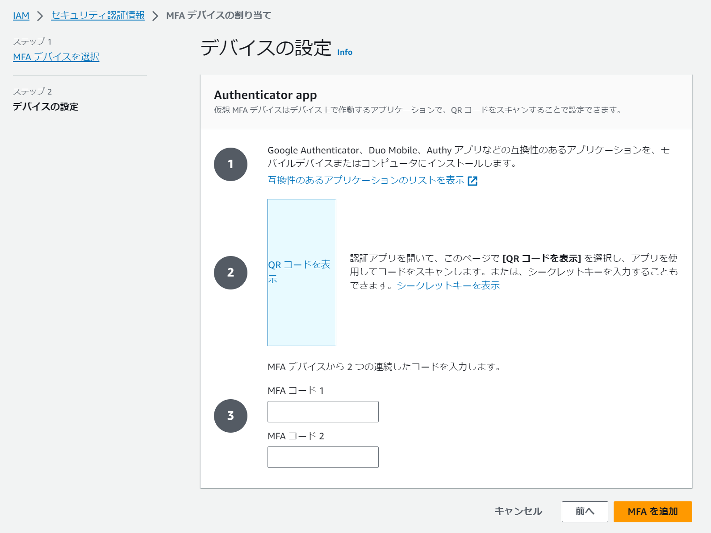

# AWS講座/第一回まとめ

## 課題

### ① AWSアカウント作成

#### 必要なもの
- 新規メールアドレス
- クレジットカード
- ルートユーザーをMFAで保護

### ② IAMの推奨設定
1. `Billing`をIAMユーザーで閲覧できるようにする
2. `AdministratorAccess`権限のIAMユーザーを作成
3. MFAで保護

### ③ Cloud9の作成
- `Amazon Linux2`で作成
- デフォルト設定のみで環境構築できる
  - 参考  
  ・[Cloud9でRuby on Railsの開発環境を構築](https://pikawaka.com/curriculums/web-service-development/aws-cloud9-rails-environment) 

### やったこと
- MFA認証を設定【Google Authenticator】
1. 設定 => セキュリティ認証情報 [ click! ]
2. MFAデバイスの割り当て [ click! ]
3. Authenticator App [ choose! ]
4. デバイスの設定 => アプリ内でQR読取・MFAコード2回入力


- IAMユーザーにAWSアカウントの請求情報の閲覧を許可する  
1. ルートにて「**アカウント**」へ移動
2. 「**IAM ユーザー/ロールによる請求情報へのアクセス**」を有効化
   - 参考  
  [IAM チュートリアル: 請求コンソールへのアクセス権の付与](https://docs.aws.amazon.com/ja_jp/IAM/latest/UserGuide/tutorial_billing.html)

- `AdministratorAccess`権限を持つIAMユーザーを作成
```
Policy
{
    "Version": "2012-10-17",
    "Statement": [
        {
            "Effect": "Allow",
            "Action": "*",
            "Resource": "*"
        }
    ]
}
```
=> ルートユーザー相当の権限を持つ  
（ルートユーザーにはアクセスできない）  
・手順
1. IAMユーザー作成
2. ☑ AWS マネジメントコンソールへのユーザーアクセスを提供
3. ☑ IAMユーザーを作成 
4. ポリシーを直接アタッチ
5. `AdministratorAccess`をアタッチ  
6. ログイン用の**コンソールパスワード**をコピー
7. サインアウト => ログイン  
8. MFA 割り当て
**※ 「Identity Centerでユーザーを作成（推奨）」 => マルチアカウントで管理する企業向けのオプション**

-  `PowerUserAccess`権限  
`Addministrator`の次に強い権限を持ったポリシーで、IAM以外の操作が全て行える
```
Policy
{
  "Version": "2012-10-17",
  "Statement": [
    {
      "Effect": "Allow",
      "NotAction": "iam:*",
      "Resource": "*"
    }
  ]
}
```
**※ IAMが操作できないとなにかと不便**
- 自分のパスワードが変更できない。MFAの設定もできない。
- 自分のアカウントのアクセスキーを発行・削除できない。
- ELB等で利用するサーバ証明書のアップロード・削除等ができない。
