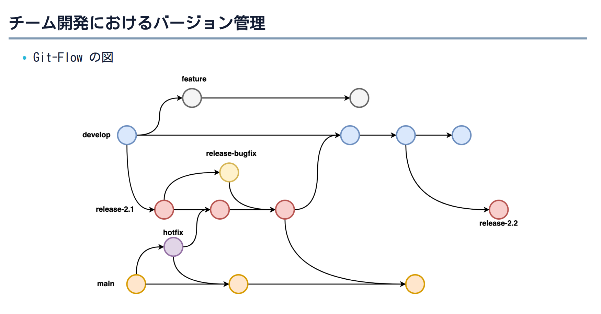

# AWSコース/第2回講座まとめ

### VCS-Version Control System(バージョン管理システム)
ソフトウェア開発やファイルの管理に使用されるツールやシステムのこと。  
VCSはファイルやコードの変更を追跡し変更履歴を記録する。

## DVCS-Distributed Version Control System(分散型バージョン管理システム)
リポジトリを分散させ、各開発者が独立して作業を行いながら変更履歴を管理する。

## CVCS-Centralized Version Control System(集中型バージョン管理システム)
リポジトリが中央のサーバに存在し、開発者はそのサーバからファイルや変更履歴をチェックアウトして作業する。

## Git-FlowとGitHub-Flowの違い

### ブランチ構造

- **Git-Flow:**  
 Git-Flowでは、メインブランチとしてmainブランチとdevelopブランチが使用される。  
developブランチは開発の中心となるブランチで、mainブランチは安定したバージョンのリリースを管理する。  
さらに、featureブランチ、releaseブランチ、hotfixブランチなどのさまざまな種類のブランチを使用して開発の進行や修正を管理する。

- **GitHub-Flow:**  
GitHub-Flowでは、シンプルなブランチ構造が採用されており、メインブランチとしてmainブランチが使用される。  
開発者はmainブランチから新しいブランチを作成し作業を行う。

### リリースの管理

- **Git-Flow:**  
Git-Flowでは、バージョン管理が重視されており安定したリリースをmasterブランチにマージして行う。   
リリース用のreleaseブランチを作成し、そこでバグ修正や最終テストを行う。  
リリースが準備できたら、releaseブランチをmainブランチとdevelopブランチにマージする。

- **GitHub-Flow:**  
GitHub-Flowでは、リリースはマージされたコードをデプロイすることで実現される。  
リリース用のブランチに依存する必要がなく、マージされたコードを直接デプロイすることが一般的。
### ワークフローのシンプルさ

- **Git-Flow:**  
Git-Flowは、複数のブランチや作業フローを管理するため比較的複雑なワークフローであり、  
開発プロジェクトが大規模で複雑な場合に適している。

- **GitHub-Flow:**  
GitHub-Flowは非常にシンプルなワークフローであり、主に小規模なプロジェクトでの開発に適している。  
マージとデプロイの単純なフローによりチーム全体の理解が容易。

### 図解

- **Git-Flow:**



- **GitHub-Flow:**


## SSHキーを使用したローカルリポジトリとリモートリポジトリの連携

### はじめに
- Gitの初期設定を行う
```

# Gitでは誰が変更したのかが重要である為ユーザー名とe-mailの設定が必須
git config --global user.name "username"
git config --global user.email "e-mail"

# 新規リポジトリのデフォルトブランチ名をmainに変更
git config --global init.defaultBranch main

# 正しく設定できているか確認
git config --list

```

- 補足(`user.emailにnoreply アドレスを使う`)  
GitHub は Committer の判別にメールアドレス(git config の user.email)を使用している。  
これを連携させないと、GitHub 上のログに本人のアバターが出ない。  
しかし、自分のメールアドレスは登録したくないという人のために  
GitHub 側にて ダミーのメールアドレス(noreply アドレス) が用意されている。
```

1.GitHub にログイン
2.https://github.com/settings/emails を開く
3.「Keep my email address private」を ON にする
4.表示されたID+USERNAME@users.noreply.github.comのような形式のダミーアドレスを「user.email」に登録する
```  

### SSHキーを使ってGithubと連携する
GitHub(リモートリポジトリ)とローカルを連携させるためにSSHキーを使って連携させる。  
手順は以下の通り    
```

1.ローカルのターミナルにてSSHキーを保存するディレクトリに移動
cd ~/.ssh

2.SSHキーをRSA形式で生成
オプションなし: ssh-keygen 
よりセキュアに生成: ssh-keygen -b 4096 -C "user.e-mailを指定"

※コマンドを実行してSSHキーを生成する際に
「SSHキーを保存するファイルのパス」と
「秘密鍵を保護するためのパスフレーズの追加」(push時にこのパスワードの入力が求められるようになる)
の確認がされる。
特別変更する必要がなければデフォルトのままEnterキーを押す。

3.公開鍵を表示しコピーする
cat ~/.ssh/id_rsa.pub

4.GitHubと連携する
GitHubにて
「https://github.com/settings/keys」ページで  
「New SSH keys」をして  
「Title」には任意の名前を付け  
「Key」にはコピーした公開鍵をペーストする。  
「Add SSH Key」を押下し完了。
```

補足
- `-b`オプション(bits): 生成される鍵のビット数を指定(デフォルト値:2048)
- `-C`オプション(Comment): 生成される鍵に追加するコメントを指定(一般的に鍵の所有者のe-mailを指定する)
- `id_rsa.pub`ファイル: SSHキーペアの公開鍵ファイル