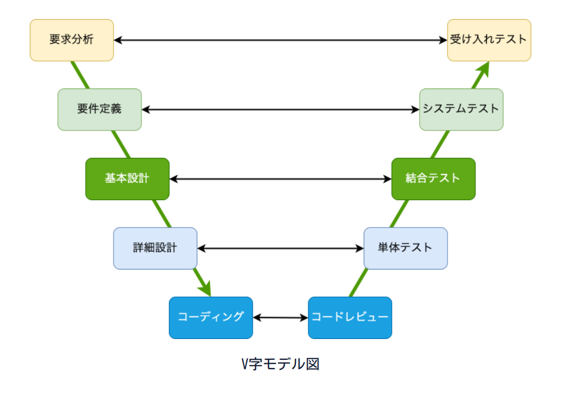
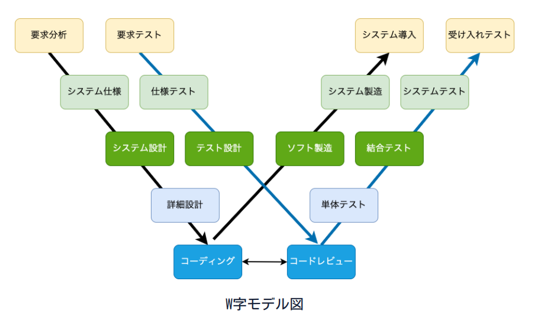
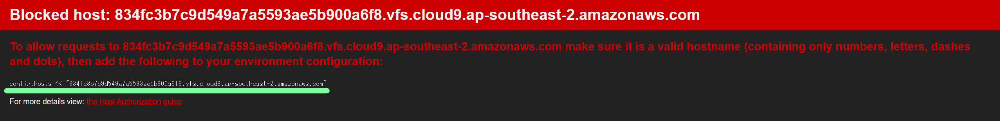
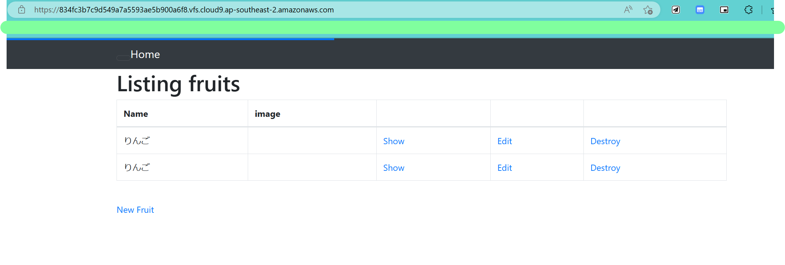
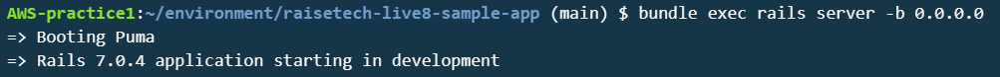
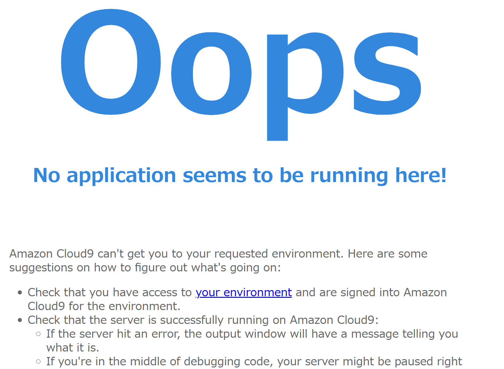
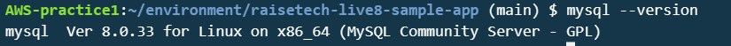
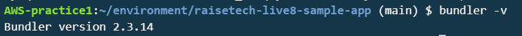

# AWS第3回まとめ
## Web アプリケーションとは  
ブラウザ上で利用できるアプリケーション

## Web アプリケーションでよく使う(見かける)言葉  
「クライアントとサーバ」「リクエストとレスポンス」「通信」「HTTPメソッド」「HTML/CSS/JS」

## 通信
クライアント-サーバ間のリクエストとレスポンスのやり取りのこと  

- 通信フォーマット 
=>「どういった内容」を「どのような形」で「どのようにして送るか」を決めるためのもの 
  - JSON  
  - XML  

同じ情報(キーと値の組み合わせ)を表現
```
// JSON形式
{
 "Name": "Tekkun",
 "homeTown": "secret",
 "Age": "secret",
 "active": true
}

```

```
<!-- XML形式 -->
<?xml version="1.0" encoding="UTF-8" ?>
<root>
<Name>Tekkun</Name>
<homeTown>secret</homeTown>
<Age>secret</Age>
<active>true</active>
</root>
```

## HTTPメソッド
リクエストを送る際に「行いたい処理」を伝えるための情報

## システム(アプリケーション)開発の流れ  
**Web 系・業務系、両者の開発の流れに大きな違いはない**  
- **V字モデル**---最も基本的なプロセスモデル  



- **W字モデル**---V字モデルにおける従来の問題点を解決する方法として発達したモデル



## システム(アプリケーション)開発手法
- **Waterfall**  
開発工程を滝のように表した方式で、上流から下流へと一方方向に進む。  
その仕組み上、下流の工程で発見した上流の漏れを戻って含める(上流へ戻る)ことはしない。

- **Agile**  
要求から開発・テストまでの流れを何度も繰り返す。  
積極的に発注者とやりとりを行うため成果物のブレは少ない。  
クライアントなどからの変更の要求が頻繁に発生するような  
柔軟な開発プロセスが求められるプロジェクトに適している。

- **Scrum**  
アジャイル手法の中でも広く採用されているフレームワーク。  
アジャイルの流れを周期的に繰り返し、振り返りや評価を含めつつ進める。  
(プランニング、デイリースクラム、スプリントなど)

## 外部ライブラリと構成管理の重要性
- 外部ライブラリ  
誰かがプログラムにおいてよく利用される機能を切り出して、再利用しやすいようにまとめたもの。  
- 構成管理ツール  
外部ライブラリは非常に便利なものだが、インストールの数が大量になってくると  
「何を入れたのか・どのバージョンを入れているのか」などが人の手では管理できなくなってくる。  
そこで構成管理ツールを活用することで、構成を簡単に再現する事ができます。  

## Gem と Bundler
- **Gem**  
**Rubyで使われるパッケージングされたアプリケーション、モジュールの事。**  
様々なアプリケーションで外部ライブラリとして利用する場合はこの Gem という形式で利用する。   
しかし Gem を利用して複雑なアプリケーションを作ろうとする場合、いくつか開発の妨げになり得ることがある。  
Gem の動作に必要なモジュールは自身で入手しなければならず、  
Gem には「Gem が動作する為に必要なプログラム」や「Gem が必要なGemの種類、バージョン」など、  
管理しなければならない項目が非常に多いため、複数人で開発する時これらの情報を人間が管理するのは厳しい。

- **Bundler**  
その為、**構成管理ツールのBundler**を使う。  
この Bundler を利用する事でアプリケーションに必要なライブラリをバージョンも含めて、  
他の開発者と同一のものをダウンロードしてくれるようになる。  
`bundle install` と実行するだけで、実行した場所にあるGemfileを読み取り、  
記載された種類とバージョンの Gem をインストールしてくれる。  
Bundler が読み込む Gemfile ではバージョンを完全一致で指定できるほか、  
「x.x.x 以上」のように柔軟な条件設定も可能。

## Webサーバ/APサーバ/DBサーバ

- **Webサーバ**  
クライアントのリクエストを受け取り、利用者へレスポンスを返す役割を持ったサーバ。  
クライアントからのリクエストを受け取ると、APサーバに内容を伝え、  
処理が終わるとAPサーバから結果を受け取りブラウザに表示する。

- **APサーバ(アプリケーションサーバ)**  
利用者のリクエストを元に処理を行い、結果を返却する役割を持ったサーバ。  
Webサーバから受け取ったリクエスト内容を用いて処理を実行し、DBサーバにデータを要求する。  
DBサーバから結果が返ってきたらWebサーバ処理結果を伝える。  
最近のフレームワークには「組み込み」の内蔵型のアプリケーションサーバーもあり、  
特にサーバーを意識することなくアプリケーションの起動や実行ができるようになっている。

- **DBサーバ**  
システムで扱うデータベースは、住所録のようなデータの塊を郵便番号・住所・電話番号などの項目に分解し、  
後から利用しやすいように蓄積するソフトウェアを指す。

## DB と SQL

- **DB(database)**  
データを整理して検索しやすくした情報の集まりの事。

- **RDB(relational database)**  
データの関係性(relational)に基づいて設計や定義されるDBの事。

- **RDBMS(relational database management system)**  
RDBを管理する為のシステム。
(Oracle DataBase, MySQL, SQL Server, DB2, PostgreSQL, H2Databaseなど)

## その他 Ruby用語など
- Rails（フレームワーク）
- Gem（ライブラリ）
- Bundler（構成管理ツール）

## Rails による Web アプリケーションの起動(Cloud9)
### Railsの環境構築  
1. Rubyをインストール  
`rvm install <version>`
2. Bundlerをインストール  
`gem install bundler`
3. Yarnパッケージマネージャをインストール  
`npm i -g yarn`
4. Yarnをインストール  
`yarn install`  
プロジェクトの依存関係を解決し必要なパッケージをインストールする  
5. Railsをインストール  
`gem install rails <version>`

### 設定の修正  
1. サンプルのDB設定ファイルを元に実際の設定ファイルを作成  
`cp config/database.tml.sample config/database.yml`
2. database.ymlを修正  
`password: 任意のパスワード`  
`socket: /var/lib/mysql/mysql.sock`(developmentおよびtest) 
4. bin/cloud_devの権限を変更
    - コマンド  
  `sudo chmod 700 bin/cloud_dev`
5. Railsアプリケーションが特定のホスト名からのリクエストを受け付けるように設定  
6. config/environments/development.rbファイルに「`config.hosts << ~`」を追記  

```
  config.file_watcher = ActiveSupport::EventedFileUpdateChecker

  # Uncomment if you wish to allow Action Cable access from any origin.
  # config.action_cable.disable_request_forgery_protection = true
  
  config.hosts << "45193b51e91841f9a99d2648bbdb4ca0.vfs.cloud9.ap-northeast-1.amazonaws.com"
  
end
```  



### DBの再構築から起動まで
1. DB作成  
`bundle exec rails db:create`  
2. DBマイグレーションを実行  
`bundle exec rails db:migrate`  
3. 起動  
`bundle exec rails server -b 0.0.0.0`
4. ブラウザで確認



## 課題

### APサーバ

- 名前とバージョン確認  



- AP サーバーを終了させた場合に引き続きアクセスできるか確認  



### DBサーバ
- DB サーバー（DB エンジン）の名前とバージョンの確認



### Railsの構成管理ツール  
- 名前とバージョン  



## 参考
- [Cloud9が起動しない時の対処法](https://asobi-design.net/cloud-service/157)