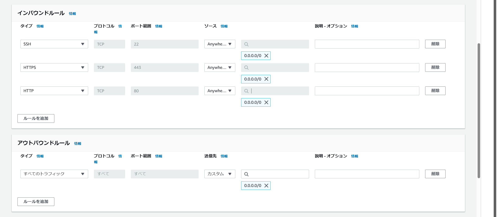
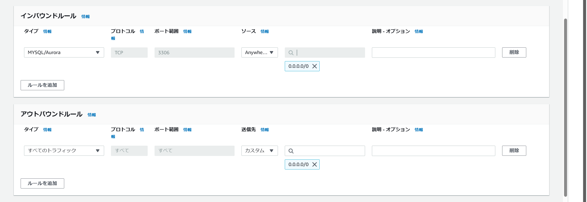
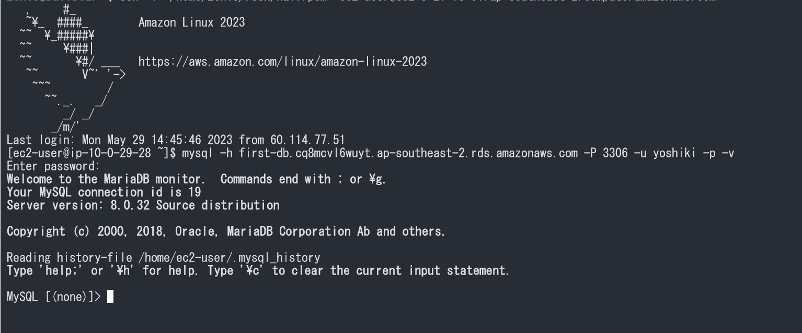

# AWS第4回まとめ

## 各セキュリティグループ
### EC2用
- SSH(port:22)を許可
- HTTP(port:80)を許可
- HTTPS(port:443)を許可
- ソース: 全てのIPアドレス(0.0.0.0/0)を許可

### RDS用
- 任意のDBポートを許可
- Type: MySQL/Aurora(port:3306)
- Protocol: TCP
- Source: 全てのIPアドレス(0.0.0.0/0)

## EC2からRDSにアクセスする方法

1. EC2にログイン  
`ssh -i location_of_pem_file ec2-user@ec2-instance-public-dns-name`
2. EC2 インスタンスを更新し最新のバグ修正とセキュリティ更新を入手  
`sudo dnf update -y`
3. MariaDB の mysql コマンドラインクライアントを Amazon Linux 2023 にインストール  
`sudo dnf install mariadb105`
4. MySQL DB インスタンスに接続する  
`mysql -h endpoint -P 3306 -u admin -p`
5. パスワードを入力
6. 接続

## VPC新規作成

## EC2インスタンス(仮想サーバ)新規作成

## RDS(MySQL)新規作成

## EC2接続

## EC2からRDSに接続

## 学び
- インフラ領域は想像以上に奥が深い
- EC2は起動のたびにパブリックDNS名が変わる
- SSHキーを`~/.ssh/`に移動させた場合の相対パス  
`ssh -i "/home/username/.ssh/half.pem"`  
`ssh -i "~/.ssh/half.pem `
- Windowsのファイルシステム配下にあるディレクトリ上だとパーミッションを変更できない  
**つまり`chmod 400 example.pem`(読取のみ許可)がきかない**

## 参考
- [MySQL DB インスタンスの作成と接続(公式)](https://docs.aws.amazon.com/ja_jp/AmazonRDS/latest/UserGuide/CHAP_GettingStarted.CreatingConnecting.MySQL.html)
- [見ながらやろう! AWSを始めよう -VPC構築編-](https://qiita.com/nago3/items/f5badeb4f7e5c32b0540)
- [見ながらやろう! AWSを始めよう -RDS編-](https://qiita.com/nago3/items/1cd6daa5ad6377e325ed)