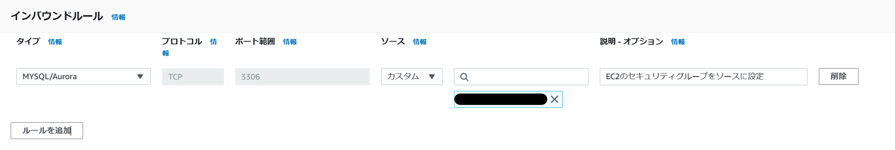
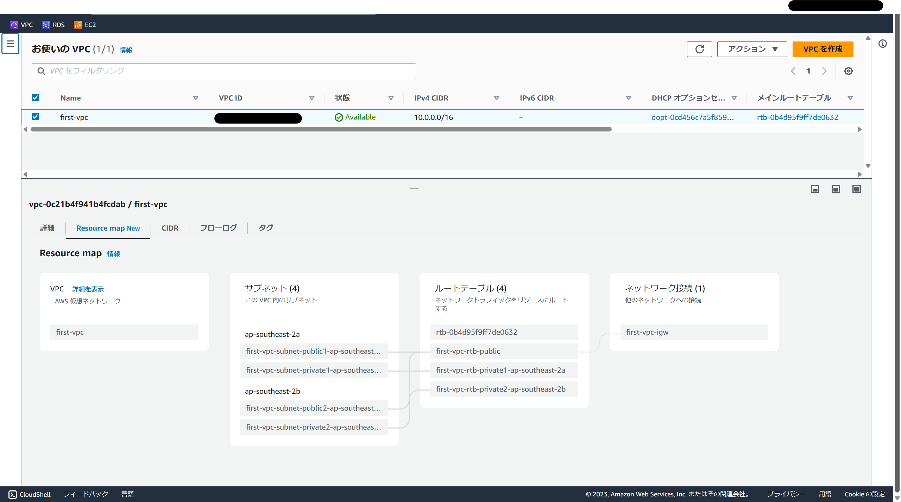
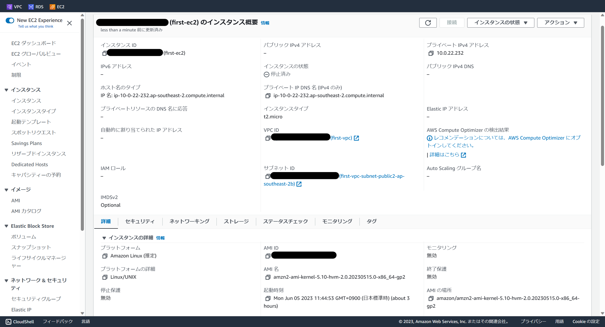
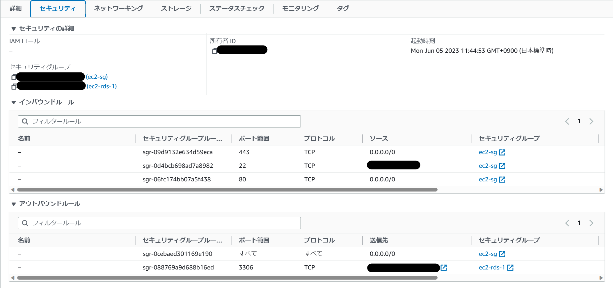
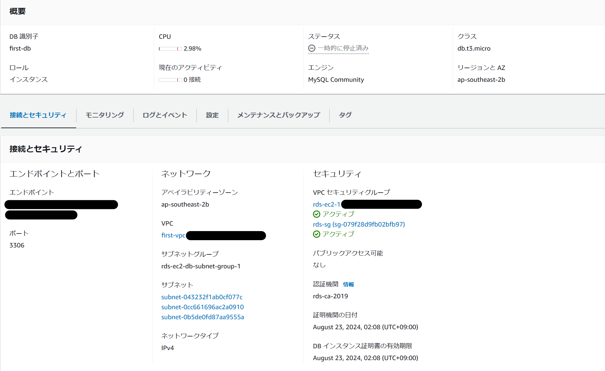
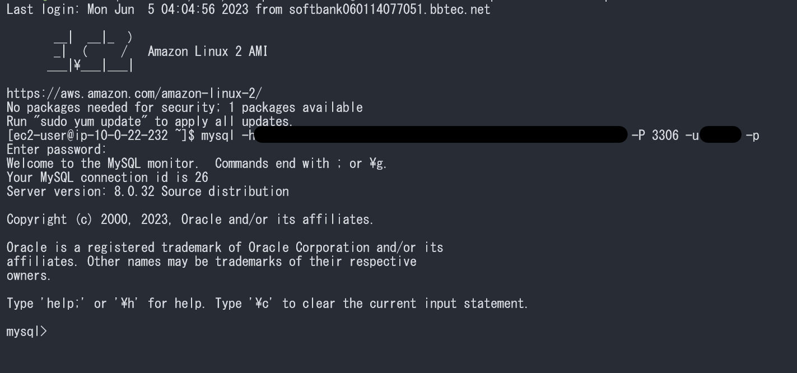

# AWS第4回まとめ

## IAM(Identity Access Management)
AWSのサービスやリソースへのアクセスを管理するサービス

### 構成要素
- **ルートユーザー**  
アカウント作成時に作成される最も強い権限を持つユーザー

- **IAMユーザー(人・プログラム)**  
アカウント内で個別に作成できるユーザー  
実際の開発や運用はIAMユーザーで行う

- **プリンシパル（認証主体）**  
AWSのリソースを操作するユーザーやアプリケーションのこと  
プリンシパルは、IAMユーザーやロールで認証を行ってAWSリソースを操作する

- **IAMポリシー**  
AWSリソースへの操作の権限を制御する機能  
JSON形式で記述する  
プリンシパルにアタッチして使用する

- **IAMロール (role: 役割・任務)**  
ポリシーを複数アタッチして権限をひとまとめにしたもの  

- **IAMグループ**  
複数のIAMユーザーに同じ権限を付与できる機能  
プリンシパルとしては認識されない  
1つのIAMユーザーは複数のグループに所属できる

- **アクセスキー**  
IAMユーザー内で生成できる  
IAMユーザーまたはルートユーザーの長期的な認証情報  

## IAMロールについて
AWSリソースに紐づけられる役割
ポリシーを複数アタッチして権限をひとまとめにしたもの  

### 特徴
- ロールにはポリシーをアタッチできる
- 各リソース(EC2インスタンスやRDSインスタンスなど)に対して1つ割り当てられる  
- STS(一時的な認証情報)を用いることでセキュアにリソースを操作できる
- ロールは「信頼関係」と「権限」を持つ
  - **信頼関係**  
  誰がこのロールにスイッチできるか
  - **権限**  
  このロールでなにができるか

### IAMユーザーとIAMロール
- **IAMユーザー**  
オンプレミスなど、**AWSの外に存在するアプリケーションやAWSを利用する開発・運用メンバー向け**に利用される  
=> IAMユーザーは主に実際に操作を行う運用者や開発者向けに用いられる

- **IAMロール**  
IAMロールは主に**AWSリソース自身、またはAWSにデプロイしたアプリケーション**が  
AWSリソースを操作するようなケースで用いられる

## ロールとSTS
- **STS (Security Token Service)**  
STSは認証情報を含んだ一時的なセキュリティトークンを生成する機能  
(アクセスキー・シークレットキー・セッショントークンが含まれている)

- 用途  
> EC2はインスタンスプロファイルの情報を元に、  
> アタッチされたIAMロールのAssumeRoleを行い、  
> 一時的な認証情報(クレデンシャル)を取得する  
> これによって、IAMロールにアタッチされた権限に基づいたAWSリソースの操作が可能になる  

STSを使うことで、**IAMユーザーを作る必要がなくなり、**  
結果として、**IAMユーザーごとに作成されるアクセスキーを管理する必要がなくなる。**  
=> 加えて、**一時的な認証情報であるため**、認証情報の流出のリスクが  
IAMユーザーのアクセスキーを利用するケースと比べ低くなる

- `"Action": ["sts": AssumeRole]` → IAMロールを引き継ぐためのアクション  
  - AssumuRole  
  IAMロールの力の引き継ぎ
  - assume  
  (権力など)を手に入れる、(役目・責任など)を引き受ける

## IAMユーザーとアクセスキー [[参考]](https://docs.aws.amazon.com/ja_jp/IAM/latest/UserGuide/id_credentials_access-keys.html) 

IAMユーザーでは「アクセスキー」が生成できる。  
「アクセスキー」をアプリケーションなどに認証情報として設定することで、  
スクリプトやアプリケーションが「CLI」や｛SDK｝を使ってAWSリソースを操作(署名)できるようになる  
=> **※重要** つまりアカウントに永続的にアクセスできるようになるため危険  
=> **バージョン管理システムや他者の目につく場所に公開してはならない**  

**公式引用**
> ベストプラクティスは、アクセスキーのような長期的認証情報を作成するのではなく、  
> IAMロールなどの一時的なセキュリティ認証情報を使用することです

### アクセスキーを構成する2つの要素
リクエストを認証するためには両方を使用する必要がある
- **アクセスキーID**  
- **シークレットアクセスキー**

## IAMポリシーの書き方  
```
PARCモデル

Principal: ~
Action: ~
Resource: ~
Condition: ~
```

- **Principal**  
リソースへアクセスするプリンシパルの情報

- **Action**  
「何のサービス」の「どのような操作」かを指定

- **Resource**  
どのリソースに対するポリシーであるか「ARN」で指定する  
(ARN[arn:aws:~]： リソース作成時に各リソースに割り振られ固有の文字列)

- **Condition**  
「条件」を指定する  
  - **AND条件** → 縦にカンマで区切る
  - **OR条件** → 横並びにカンマで区切る

## IAMポリシーの種類 [Identity Based Policy]

### Identity Based Policy (→ Resource Based Policy)
「プリンシパル」（IAMユーザーやIAMロール）  
にアタッチするアイデンティティベースのポリシー    
**※ アイデンティティベースのポリシーには「Principal」を書かない**  
=> ポリシーをアタッチする対象（ロールかユーザー）が明確であるため

### ① AWS管理ポリシー
AWS側でデフォルトで用意しているポリシー

### ② カスタマー管理ポリシー
独自でAWS管理ポリシーより詳細に設定するためのポリシー  
「JSON」や「ポリシージェネレーター（GUI）」で設定できる

## 各セキュリティグループ
### EC2用
- SSH(port:22)を許可  
  - Source: マイIPを指定(このデバイスのIPアドレス)
- HTTP(port:80)を許可
- HTTPS(port:443)を許可
  - Source: 全てのIPアドレス(0.0.0.0/0)を許可


### RDS用
- 任意のDBポートを許可
- Type: MySQL/Aurora(port:3306)
- Protocol: TCP
- Source: EC2のセキュリティグループIDを指定



## VPC設定



- **サブネット(パブリック/プライベート)**  
VPCをより小さなネットワークに分割するためのセグメント。  
サブネット内にAWSリソースを適切に配置する。
- **ルートテーブル**  
VPC内のネットワークトラフィックの転送を制御する。  
送信先のネットワーク（宛先）と転送先間の関連を定義する。
- **IGW(Internet Gateway)**  
VPC内のプライベートなネットワークとパブリックなインターネットとの接続を可能にするサービス  
- **Region**  
実際にデータセンターが配置されている地理的な領域。  
`エリア+数字`で表現される(東京: ap-northeast-1)
- **AZ(Availability Zone)**  
リージョン内の複数の物理的なデータセンターで構成されたセグメント。  
`リージョン名+アルファベット1文字`で表現される(例: ap-northeast-1a, ap-northeast-1c)

## EC2インスタンス(仮想コンピューティング環境)新規作成




- **AMI(Amazon Machine Image)**  
設定: AMazon Linux 2  
インスタンスの起動に必要なソフトウェア設定(オペレーティングシステム、アプリケーションサーバー、アプリケーション)を含むテンプレート。
- **インスタンスタイプ**  
設定: t2.micro(無料利用枠)  
このEC2インスタンスに必要なインスタンスのサイズや性能を選択する
- **パブリックIPの自動割り当て**  
デフォルトでは無効になっている
- **新規キーペア作成**  
  - ローカルに公開鍵がダウンロードされる
  - `.ssh`に公開鍵を移動
  
## RDS(MySQL)新規作成


- **事前準備**
  - DB用セキュリティグループを作成  
  インバウンドルール  
  => タイプ[**MySQL**] プロトコル[**TCP**] ポート範囲[**3306**] ソース[**EC2セキュリティグループ**]

- **データベースエンジン**  
設定: MySQL
- **デプロイオプション(可用性と耐久性: Multi-AZ)**  
無料利用枠では設定できない。
- **接続**  
1. EC2コンピューティングリソースに自動接続
2. サブネットグループを設定
3. セキュリティグループを設定

## EC2ログインからMySQLログインまで


1. EC2にログイン  
`ssh -i location_of_pem_file ec2-user@ec2-instance-public-dns-name`
2. EC2 インスタンスを更新し最新のバグ修正とセキュリティ更新を入手  
`sudo yum update -y`
3. 念のためMariaDBをアンインストール  
`sudo yum remove mariadb-libs`
4. MySQL公式のyumリポジトリを追加  
`sudo yum install https://dev.mysql.com/get/mysql80-community-release-el7-1.noarch.rpm -y`
5. インストールするバージョンの有効化  
＜MySQL8.0 を使用する場合＞  
`sudo yum-config-manager –enable mysql80-community`  
＜MySQL5.7 を使用する場合＞  
`sudo yum-config-manager –disable mysql80-community`  
`sudo yum-config-manager –enable mysql57-community`  
6. MySQLをインストール  
`sudo yum install mysql-community-server` 
7. バージョン確認  
`mysql --version`    
8. MySQLにログイン  
`mysql -h <RDSのエンドポイント> -P <ポート番号> -u <マスターユーザー名> -p

### 簡易版[[参考]](https://dev.classmethod.jp/articles/sales-rds-ec2-session/)
1. EC2にログイン
2. EC2上にMySQLをインストール  
`sudo yum install mysql`
3. MySQLにアクセス  
`mysql -u admin -p -h RDSのエンドポイントを張り付け`
`

## トラブルシューティング
- GPGキーエラー  
```
Failing package is: mysql-community-libs-5.7.37-1.el7.x86_64
GPG Keys are configured as: file:///etc/pki/rpm-gpg/RPM-GPG-KEY-mysql
```  
yumではパッケージが改ざんされているか検証するためにGPGキーを利用していることがあり、  
このGPGキーには有効期限が設定されている関係で一定期間が経つと検証が行えなくなりインストールが停止してしまう。

- 解決策  
**新しいGPGキーをインストールすることで解決できました**  
`sudo rpm --import https://repo.mysql.com/RPM-GPG-KEY-mysql-2022`  

## 学び
- インフラ領域は想像以上に奥が深い  
- SSHキーを`~/.ssh/`に移動させた場合の絶対パスと相対パス  
`ssh -i "/home/username/.ssh/example.pem"`  
`ssh -i "~/.ssh/example.pem"`  
- LinuxからWindowsのファイルシステム配下にあるファイルのパーミッションは変更できない  
**つまり`chmod 400 example.pem`(読取のみ許可)がきかない**  
なのでLinux上で作業することにした

## 参考
- [[MySQL] アップデート時にGPGキーのエラーで停止してしまう場合](https://blog.katsubemakito.net/mysql/mysql-update-error-g)
- [EC2インスタンスにパブリックIPが割り当てられない時に確認すること](https://soypocket.com/it/aws-ec2-public-ip-setting/)
- [Amazon Linux 2 で MySQL を使用する](https://www.acrovision.jp/service/aws/?p=736)
- [RDS for MySQLを構築しEC2からアクセスしてみる](https://dev.classmethod.jp/articles/sales-rds-ec2-session/)
