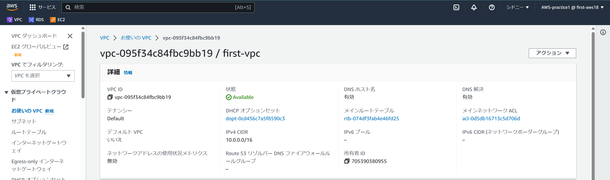
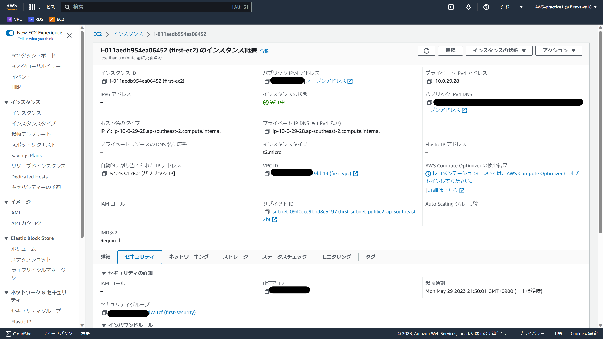
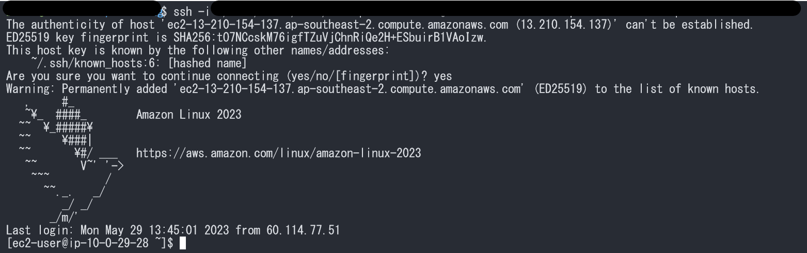

# AWS第4回まとめ

## 解決したいこと
### EC2からRDSにアクセスできない
主に[公式ドキュメント](https://docs.aws.amazon.com/ja_jp/AmazonRDS/latest/UserGuide/CHAP_GettingStarted.CreatingConnecting.MySQL.html)を参考にしました
- 試したこと
1. EC2にログイン(成功)
2. `sudo dnf update -y`
3. `sudo dnf install mariadb105`
4. `mysql -h <my-endpoint> -P 3306 -u yoshiki -p`
5. パスワードを入力
6. アクセスできない(↓結果)
```
Enter password:
ERROR 2002 (HY000): Can't connect to MySQL server on 'first-db.cq8mcvl6wuyt.ap-southeast-2.rds.amazonaws.com' (115)
```

## VPC新規作成


## EC2インスタンス(仮想サーバ)新規作成


## RDS(MySQL)新規作成


## EC2接続


## 学び
- EC２は起動のたびにパブリックDNS名が変わる

## 参考
- [MySQL DB インスタンスの作成と接続(公式)](https://docs.aws.amazon.com/ja_jp/AmazonRDS/latest/UserGuide/CHAP_GettingStarted.CreatingConnecting.MySQL.html)
- [CLIによるパーミッションの変更はLinux上でなければできない](https://qiita.com/onishi_820/items/858185a792dea739e040)